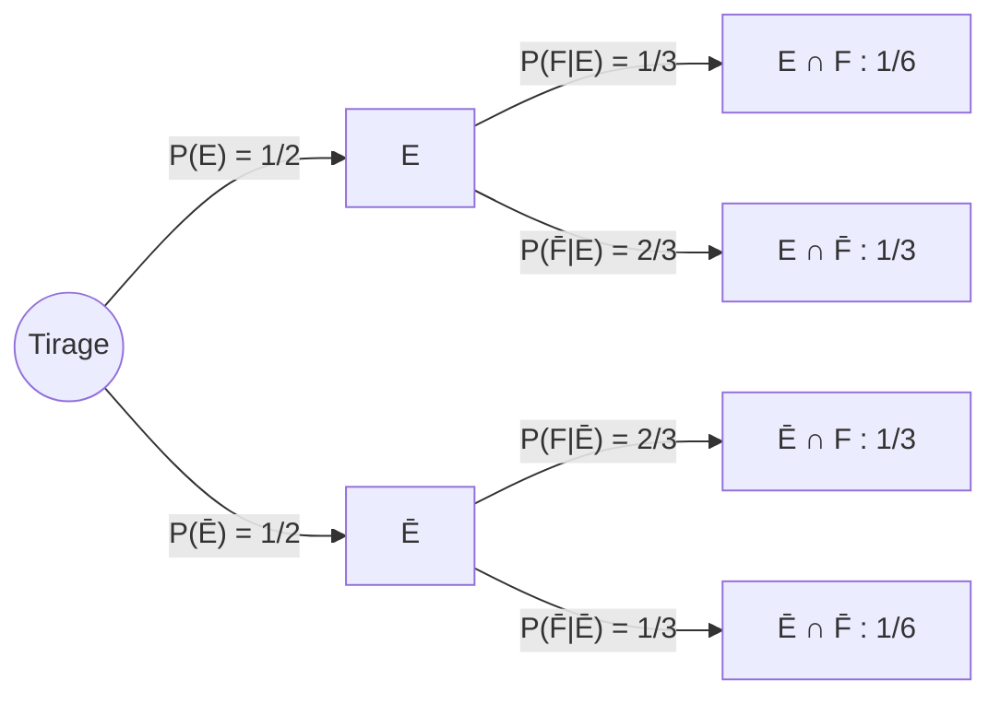

# Chapitre 2 — Probabilités conditionnelles

Deux situations obligent à conditionner :

- on dispose d'une **information partielle** sur le résultat, qui change les probabilités ;
- il est plus simple de **raisonner par cas** (pays par pays, machine par machine…).

## 2.1 Définition et propriétés

!!! definition "Probabilité conditionnelle"
    Si $P(F) > 0$, la probabilité de $E$ **sachant** $F$ est

    $$
    P(E \mid F) = P_F(E) = \frac{P(E \cap F)}{P(F)}
    $$

    Tout se passe comme si $F$ devenait le nouvel univers.

### Arbre pondéré et tableau de contingence

Exemple : urne avec 2 blanches et 2 noires, deux tirages **sans remise**.
$E$ = « blanche au 1er tirage », $F$ = « blanche au 2e ».

- On **multiplie** le long d'un chemin pour obtenir la probabilité de l'intersection.
- À chaque embranchement, la somme des branches vaut **1**.

|  | $E$ | $\overline{E}$ |
|--|:---:|:---:|
| $F$ | $1/6$ | $1/3$ |
| $\overline{F}$ | $1/3$ | $1/6$ |

!!! theoreme "Évènements contraires"
    $P(E \mid F) + P(\overline{E} \mid F) = 1$, et $P(\cdot \mid F)$ est elle-même une
    fonction de probabilité.

!!! piege "Ce qui est faux"
    - $P(E \mid F) + P(E \mid \overline{F}) = 1$ : **faux** en général (on change de condition).
    - $P(A \mid B) = P(B \mid A)$ : **faux** en général (c'est tout l'objet de Bayes).

!!! theoreme "Formule des probabilités composées (multiplication)"
    $$
    P(E_1 \cap E_2) = P(E_1)\,P(E_2 \mid E_1)
    $$

    $$
    P(E_1 \cap E_2 \cap E_3) = P(E_1)\,P(E_2 \mid E_1)\,P(E_3 \mid E_1 \cap E_2)
    $$

    et ainsi de suite : c'est la lecture d'un chemin dans l'arbre.

## Indépendance

!!! definition "Deux évènements indépendants"
    $E$ et $F$ sont indépendants si

    $$
    P(E \cap F) = P(E)\,P(F)
    $$

    Si $P(F) > 0$, c'est équivalent à $P(E \mid F) = P(E)$ : savoir que $F$ s'est
    produit ne change rien pour $E$.

!!! theoreme "Indépendance et complémentaires"
    $E$ et $F$ indépendants $\iff$ $E$ et $\overline{F}$ indépendants
    (et donc aussi $\overline{E}$ et $\overline{F}$).

??? note "Démonstration"
    $P(E \cap \overline{F}) = P(E) - P(E \cap F) = P(E) - P(E)P(F) = P(E)\,(1 - P(F)) = P(E)\,P(\overline{F})$.

!!! piege "Indépendant ≠ incompatible"
    - **Incompatibles** : $E \cap F = \emptyset$, notion **ensembliste** (pas besoin de $P$).
    - **Indépendants** : $P(E \cap F) = P(E)P(F)$, notion qui **dépend de $P$**.
    - Deux évènements **possibles et incompatibles ne sont jamais indépendants** :
      $P(E \cap F) = 0$ alors que $P(E)P(F) > 0$.

!!! definition "Trois évènements indépendants"
    $E$, $F$, $G$ sont (mutuellement) indépendants si les **quatre** égalités sont vraies :

    $$
    \begin{aligned}
    P(E \cap F) &= P(E)P(F), & P(E \cap G) &= P(E)P(G), \\
    P(F \cap G) &= P(F)P(G), & P(E \cap F \cap G) &= P(E)P(F)P(G).
    \end{aligned}
    $$

    L'indépendance **deux à deux ne suffit pas** : avec deux dés, « somme = 7 »,
    « 1er dé = 4 » et « 2e dé = 3 » sont indépendants deux à deux, mais pas tous les trois.

## 2.2 Formule des probabilités totales et formule de Bayes

!!! theoreme "Formule des probabilités totales"
    Si $\{A_1, \dots, A_n\}$ est un **système complet d'évènements** :

    $$
    P(E) = \sum_{i=1}^n P(E \mid A_i)\,P(A_i)
    $$

    Cas de deux évènements : $P(E) = P(E \mid A)\,P(A) + P(E \mid \overline{A})\,P(\overline{A})$.

!!! theoreme "Formule de Bayes"
    Elle permet de **retourner le conditionnement** : passer de $P(E \mid A_j)$ à $P(A_j \mid E)$.

    $$
    P(A_j \mid E) = \frac{P(E \mid A_j)\,P(A_j)}{\displaystyle\sum_{i=1}^n P(E \mid A_i)\,P(A_i)}
    $$

    Avec deux évènements :

    $$
    P(A \mid E) = \frac{P(E \mid A)\,P(A)}{P(E \mid A)\,P(A) + P(E \mid \overline{A})\,P(\overline{A})}
    $$

!!! methode "Reconnaître un exercice de Bayes"
    1. L'énoncé donne des probabilités **dans un sens** ($P(\text{symptôme} \mid \text{maladie})$)
       et demande **l'autre sens** ($P(\text{maladie} \mid \text{symptôme})$).
    2. Nommer les évènements, **vérifier que les « causes » forment un SCE**
       (elles couvrent tout et sont incompatibles).
    3. Faire l'arbre : 1er niveau = les causes $A_i$, 2e niveau = l'effet $E$.
    4. Numérateur = le chemin qui nous intéresse ; dénominateur = $P(E)$ par les probabilités totales.

### Exemple : grippe ou rougeole ?

90 % des enfants malades ont la grippe ($G$), 10 % la rougeole ($R$).
$P(EC \mid R) = 0{,}95$ et $P(EC \mid G) = 0{,}1$ ($EC$ : éruption cutanée).

$$
P(R \mid EC) = \frac{0{,}95 \times 0{,}1}{0{,}95 \times 0{,}1 + 0{,}1 \times 0{,}9} = \frac{0{,}095}{0{,}185} \approx 0{,}51
$$

Malgré un symptôme « typique », l'enfant n'a qu'une chance sur deux d'avoir la rougeole :
la grippe est beaucoup plus fréquente au départ.

## 2.3 Hors programme : interprétations

- **Fréquentiste** : $P(E)$ est la fréquence limite d'apparition de $E$ sur une infinité de répétitions.
- **Bayésienne** : $P(E)$ mesure une croyance, mise à jour par la formule de Bayes quand
  on observe de nouveaux évènements.

## Acquis d'apprentissage

- [ ] Calculer $P(E \mid F)$.
- [ ] Traduire un énoncé en arbre et en tableau de contingence.
- [ ] Reconnaître deux évènements indépendants.
- [ ] Reconnaître un système complet d'évènements.
- [ ] Utiliser la formule de multiplication pour $P(E \cap F)$.
- [ ] Savoir quand utiliser les probabilités totales, et appliquer Bayes.
