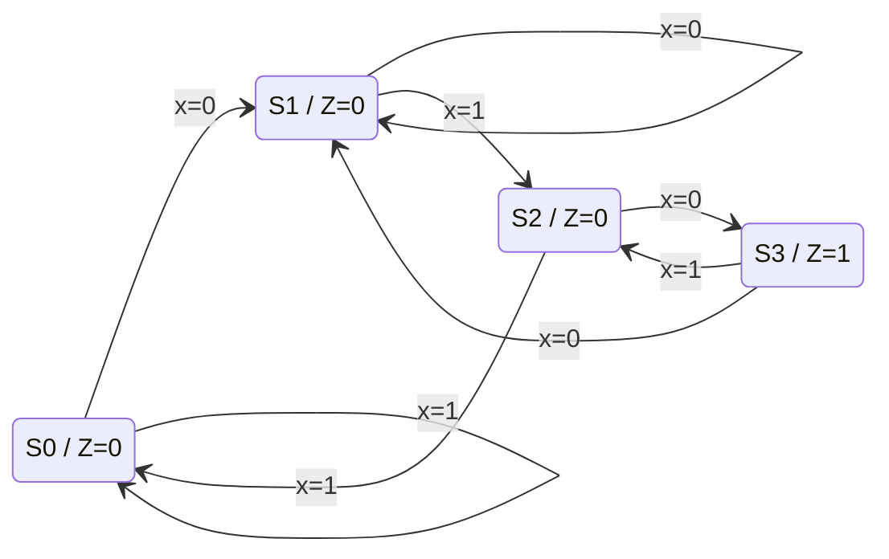
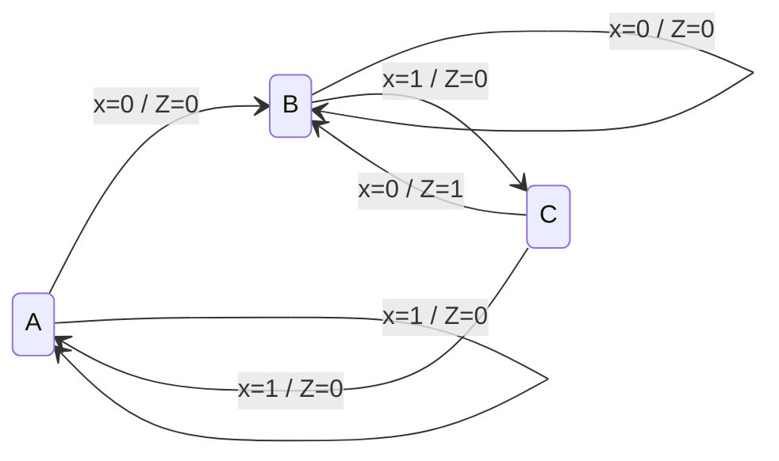

# TD 4 — Les machines à états

Rappels : [chapitre 4](../cours/chapitre-4-machines-etats.md). Énoncés :
`pdf/te302/TravauxDirigésTexte.pdf`.

## Exercice 1 — Machine de Moore pour 5 LEDs

Même démarche que l'[exemple du cours](../cours/chapitre-4-machines-etats.md#exemple-sequence-de-leds-commandee-par-un-bouton),
avec la séquence de l'énoncé :

1. Vérifier qu'on peut se contenter de **3 sorties** : il faut regarder quelles
   LEDs s'allument toujours ensemble (elles peuvent partager une même sortie).
2. 5 états → 3 bascules D, $E_k$ codé par $k$ en binaire.
3. Table états présents / futurs avec $b = 1$ → maintien, $b = 0$ → état suivant.
4. Les équations $D_2, D_1, D_0$ sont **les mêmes que dans le cours** (seul le
   graphe d'avancement compte, pas les motifs affichés).
5. Seules les équations des sorties $L_i$ changent : Karnaugh sur $Q_2Q_1Q_0$
   avec 101, 110, 111 en X.

## Exercice 2 — Détecteur de la séquence 010 (Moore, bascules D)

On surveille un bit série $x$ ; la sortie $Z$ vaut 1 quand les trois derniers bits
reçus sont `010`. Les **chevauchements** sont autorisés : dans `01010`, on détecte
deux fois.

**États** (chacun mémorise « ce qu'on a déjà reconnu ») :

| État | Signification | Code $Q_1Q_0$ | $Z$ |
|------|---------------|:-------------:|:---:|
| $S_0$ | rien d'utile | 00 | 0 |
| $S_1$ | on a reçu `0` | 01 | 0 |
| $S_2$ | on a reçu `01` | 10 | 0 |
| $S_3$ | on a reçu `010` | 11 | **1** |

!!! piege "Les transitions depuis $S_3$"
    Après `010`, le dernier `0` peut être le début d'une nouvelle séquence :
    avec $x = 0$ on retourne en $S_1$ (et pas en $S_0$), avec $x = 1$ on a `01` →
    $S_2$. Oublier le chevauchement est l'erreur classique.

| Présent $Q_1Q_0$ | Futur si $x = 0$ | Futur si $x = 1$ | $Z$ |
|:-:|:-:|:-:|:-:|
| 00 | 01 | 00 | 0 |
| 01 | 01 | 10 | 0 |
| 10 | 11 | 00 | 0 |
| 11 | 01 | 10 | 1 |

Avec des D ($D_i = Q_i^+$) :

$$
D_1 = x\,Q_0 + \overline{x}\,Q_1\overline{Q_0}, \qquad D_0 = \overline{x}, \qquad Z = Q_1 Q_0
$$

**Entraînement examen — avec des JK telles que $J = K$** ($T_i = Q_i \oplus Q_i^+$) :

$$
T_0 = \overline{Q_0 \oplus x}, \qquad
T_1 = x\,\overline{Q_1}\,Q_0 + x\,Q_1\overline{Q_0} + \overline{x}\,Q_1 Q_0
$$

## Exercice 3 — Même détecteur en Mealy

En Mealy, la sortie est portée par la **transition** : on détecte `010` au moment
où le dernier `0` arrive. Trois états suffisent :

| État | Signification | Code $Q_1Q_0$ |
|------|---------------|:-------------:|
| $A$ | rien d'utile | 00 |
| $B$ | reçu `0` | 01 |
| $C$ | reçu `01` | 10 |

| Présent | $x = 0$ : futur / $Z$ | $x = 1$ : futur / $Z$ |
|:-:|:-:|:-:|
| A (00) | B (01) / 0 | A (00) / 0 |
| B (01) | B (01) / 0 | C (10) / 0 |
| C (10) | B (01) / **1** | A (00) / 0 |

Avec l'état 11 en X :

$$
D_1 = x\,Q_0, \qquad D_0 = \overline{x}, \qquad Z = \overline{x}\,Q_1
$$

**Simplification** : un état de moins qu'en Moore, et des équations plus
simples. En contrepartie, $Z$ dépend directement de $x$ : elle change dès que
$x$ change (sortie asynchrone), sans attendre l'horloge.
